# Qwen 系列大模型技术发展历程：从开放中文 LLM 到原生多模态 Agent

> 版本：2026-06-02  
> 写作范围：Qwen 通用 LLM 主线、推理模型、代码/数学/长上下文、多模态、图像、语音、VLA、Embedding/Reranker 等分支。  
> 资料口径：优先采用 Qwen 官方博客、官方 GitHub、Hugging Face/ModelScope 模型卡与 arXiv 技术报告；少量工程生态资料只作为补充。详细来源见 [qwen_source_index.md](qwen_source_index.md)。

## 1. 总览：Qwen 的技术主线

Qwen 系列的演进可以概括为四条并行主线：

1. **通用 LLM 能力扩展**：从 Qwen-7B/14B/72B 起步，逐步扩展到 Qwen1.5、Qwen2、Qwen2.5、Qwen3、Qwen3.5/3.6，核心目标是更强的中英/多语理解、更长上下文、更好的指令跟随与开放生态。
2. **效率架构扩展**：从 dense decoder-only Transformer，到 GQA、MoE，再到 Qwen3-Next/Qwen3.5 的 Hybrid Attention、Gated Delta Networks 和超稀疏 MoE，核心目标是降低训练与推理成本。
3. **推理与 Agent 能力显式化**：从早期工具调用、代码解释器，到 QwQ/QVQ 长思考模型，再到 Qwen3 的 thinking/non-thinking 统一和 Qwen3.6 的 thinking preservation，核心目标是把“会回答”推进到“会规划、会调用工具、会迭代完成任务”。
4. **多模态原生化**：从 Qwen-VL/Qwen-Audio 的感知接口，到 Qwen2.5-VL、Qwen2.5-Omni、Qwen3-VL、Qwen3-Omni、Qwen-Image、Qwen-VLA，核心目标是让文本、图像、音频、视频、动作统一进入模型能力栈。

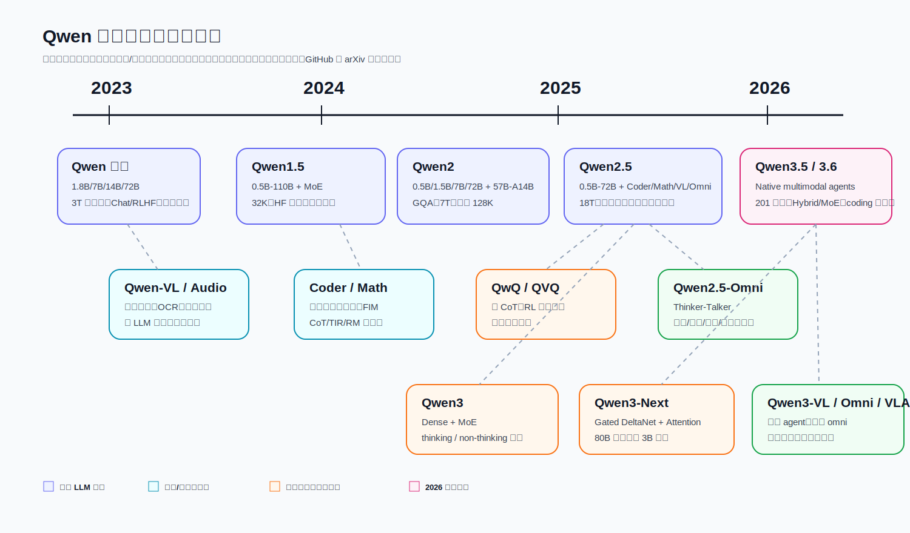

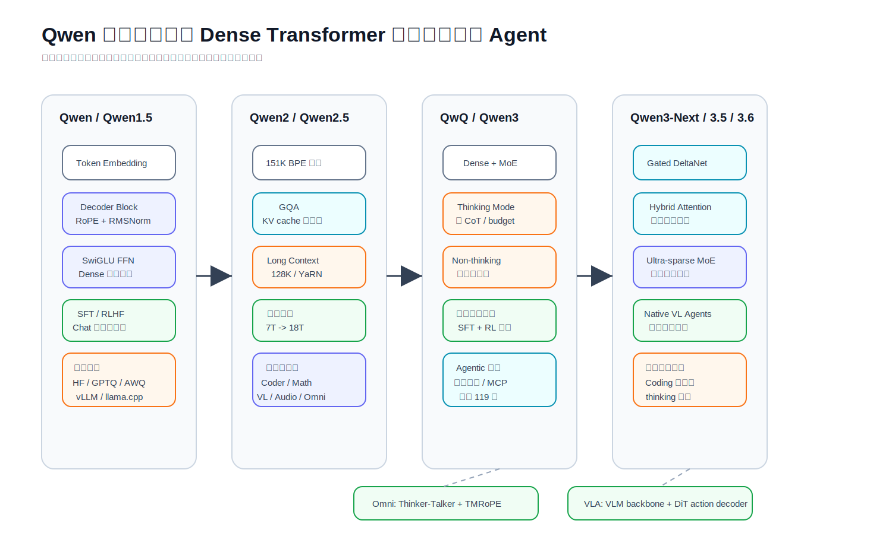

## 2. 主线逐代分析

### 2.1 Qwen 初代：开放中文/中英大模型的工程化起点

**重点解决的问题**

Qwen 初代主要解决三个问题：中文与英文基础能力不足、开源模型工具使用能力弱、训练/部署/微调工程链路不完整。它不是单点 benchmark 模型，而是试图把 base、chat、量化、微调、部署、工具调用放进同一个开放生态中。

**专门技术**

- 使用最多 3T token 的多语、多领域预训练数据，重点覆盖中文和英文。
- 发布 Qwen-1.8B/7B/14B/72B 以及对应 Chat 版本，形成从轻量到大模型的多尺度组合。
- Chat 模型通过 SFT 和 RLHF 对齐，强调对话、内容创作、翻译、信息抽取、代码、数学和工具使用。
- 早期就引入工具调用、agent、代码解释器能力，这一点对后续 Qwen-Agent 和 Qwen3 agentic 能力很关键。

**架构改进**

初代采用 decoder-only Transformer 路线，并使用 RoPE、SwiGLU、RMSNorm 等当时主流高效组件。它的创新重点不在“发明新层”，而在用较完整的训练配方和工程栈把中文/中英大模型做稳定。

**算法/训练改进**

- 预训练重点是扩大高质量中文、英文、代码、数学数据覆盖。
- Chat 后训练加入人类偏好对齐，让模型不只是续写，而能遵循指令。
- 长上下文能力在 1.8B、7B、72B 等版本中逐步增强到 32K，Qwen-14B 起初为 8K。

**工程改进**

- 发布 Int4/Int8、GPTQ、KV cache 量化、LoRA/Q-LoRA、vLLM/FastChat、WebUI/CLI 等说明。
- 官方 README 中给出显存需求、微调方式、推理框架、Docker、Ascend 910 和 Hygon DCU 支持。
- 这使 Qwen 初代的意义超出模型本身：它为后续所有 Qwen 分支建立了 Hugging Face、ModelScope、量化和部署基线。

**相对上一代的变化与局限**

作为第一代，它解决的是“能不能开放、能不能跑、能不能用”的问题。局限是多语覆盖仍以中英为中心，长上下文和 agent 仍处早期，推理能力还没有显式的 long CoT/RL 体系。

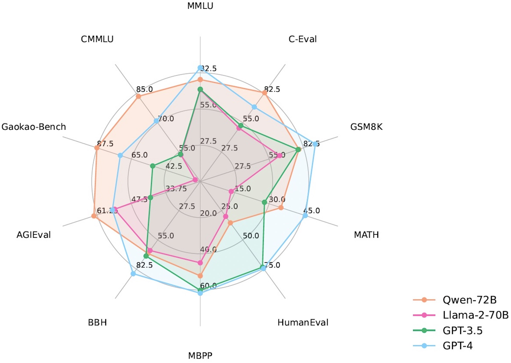

### 2.2 Qwen1.5：稳定多尺寸、生态兼容与首个 MoE 试水

**重点解决的问题**

Qwen1.5 的目标是把 Qwen 从“第一代强模型”推进到“稳定可复用的开放模型族”：更多尺寸、更统一的上下文、更标准的 transformers 集成、更好的量化与本地部署。

**专门技术**

- 发布 0.5B 到 110B 的 dense 模型，覆盖边缘设备、本地开发和云端推理。
- 上下文长度统一提升到 32K，方便开发者按统一接口做长文本任务。
- 发布 Qwen1.5-MoE-A2.7B，首次试水 Qwen 的稀疏专家路线，用较小激活参数逼近更大 dense 模型。

**架构改进**

- 整体仍是 decoder-only Transformer，但多尺寸设计更系统。
- Qwen1.5-MoE 引入专家路由，将 FFN 部分稀疏化，开始探索“总参数大、激活参数小”的效率路径。

**算法/训练改进**

- 延续 base + chat 后训练路线。
- MoE 分支侧重让多个 expert 在不同 token/任务上分工，降低激活计算成本。

**工程改进**

- `transformers>=4.37.0` 开始原生集成 Qwen2 代码基础，减少 `trust_remote_code` 依赖。
- AWQ、GPTQ、GGUF、vLLM、SGLang、llama.cpp、MLX 等生态逐步成熟。
- 这一代把“开源模型能用”推进到“各种机器、各种框架都比较容易用”。

**变化与局限**

Qwen1.5 的核心价值是稳定性和生态，而不是能力飞跃。它解决了部署和兼容问题，但推理、多模态、长上下文极限、agentic coding 还需要后续专门分支。

### 2.3 Qwen2：规模、GQA、MoE 与 128K 长上下文

**重点解决的问题**

Qwen2 解决的是“更强、更长、更省”的问题：把预训练数据扩到 7T token，提供 dense 与 MoE 两类模型，把上下文提升到 128K，并改善推理时 KV cache 成本。

**专门技术**

- 模型覆盖 0.5B、1.5B、7B、72B dense，以及 Qwen2-57B-A14B MoE。
- 多语支持扩大到 29+ 语言，已经从中英模型转向多语模型。
- 最高 128K 上下文，面向长文档、代码仓库和复杂对话。

**架构改进**

- 引入 **GQA（Grouped Query Attention）**，用较少 KV head 降低 KV cache 显存和推理带宽压力。
- MoE 版本用总参数 57B、激活约 14B 的稀疏结构，在能力和成本之间折中。
- 继续保持 decoder-only Transformer 基线，降低迁移与部署成本。

**算法/训练改进**

- 7T token 预训练让基础知识、代码、数学和多语能力显著增强。
- 长上下文训练和位置外推策略开始成为主线能力，而不只是附加功能。

**工程改进**

- 官方文档与模型卡强调 vLLM、SGLang、Transformers、llama.cpp 等部署路径。
- 量化、长上下文推理、吞吐 benchmark 成为模型发布的一部分。

**变化与局限**

Qwen2 相比 Qwen1.5 的关键变化是 GQA、长上下文和 MoE 主线化。局限是“推理模型”和“多模态模型”还主要通过专门分支完成，通用模型本身尚未统一 thinking/non-thinking。

### 2.4 Qwen2.5：通用能力、专用分支与 18T 数据的成熟一代

**重点解决的问题**

Qwen2.5 解决的是“通用模型能不能足够强，同时专用分支能不能形成体系”的问题。它把预训练数据扩大到 18T token，增加 3B/14B/32B 等中间尺寸，并把 Coder、Math、VL、Omni 等能力做成系统化分支。

**专门技术**

- dense 尺寸包括 0.5B、1.5B、3B、7B、14B、32B、72B。
- 重点增强 instruction following、结构化输出、长文本生成、代码和数学。
- 支持 128K 上下文，并在后续 Qwen2.5-1M 中继续扩展到 1M。

**架构改进**

- 主体沿用 Qwen2 的高效 decoder 设计和 GQA 路线。
- 多尺寸模型的层数、head、KV head 和 context 配置更加系统，便于按成本选择模型。

**算法/训练改进**

- 18T 预训练数据是这一代的核心。模型从“通用文本”扩展到更多 STEM、代码、数学、结构化和长文档数据。
- 后训练侧重更强指令跟随、格式约束、结构化输出、工具调用和复杂任务可靠性。
- Coder 与 Math 分支反哺主线：代码和数学数据、合成数据、奖励模型、工具增强推理成为后续 Qwen3 的重要训练来源。

**工程改进**

- Qwen2.5 成为大量开源应用、RAG、agent、代码助手的基础模型。
- 量化模型、AWQ/GPTQ/GGUF、MLX、vLLM/SGLang 支持更加成熟。
- 1M 长上下文版本面向文档、代码仓库和长会话场景，工程上更关注 attention/KV cache 成本。

**变化与局限**

Qwen2.5 是“成熟通用模型 + 专用分支矩阵”的一代。它的局限在于推理能力仍主要靠 QwQ 等独立模型显式强化，通用 Instruct 与推理模型之间仍需要切换。

### 2.5 QwQ 与 QVQ：推理能力从隐式能力变成显式训练目标

**重点解决的问题**

QwQ/QVQ 解决的是复杂数学、代码、逻辑、视觉推理中“模型需要多步思考”的问题。它们标志着 Qwen 从普通 instruct 模型进入 long CoT 和 RL 推理模型阶段。

**专门技术**

- QwQ-Preview 展示长思考能力，暴露推理模型在过程可控性、语言混杂、稳定性上的问题。
- QwQ-32B 强调通过强化学习扩展推理能力，在数学、代码和逻辑任务中显著增强。
- QVQ-72B-Preview 把视觉输入接入推理链，探索“看图后多步推理”的 VLM 路线。

**架构改进**

QwQ 没有强调全新基础架构，而是在 Qwen dense 基础上通过后训练和 RL 强化推理行为。QVQ 则结合视觉模型输入和 Qwen 语言推理能力。

**算法/训练改进**

- long CoT 冷启动让模型学会展开中间推理过程。
- 规则奖励和任务奖励用于数学/代码等可验证场景。
- 后续 Qwen3 的 thinking mode、thinking budget 和四阶段后训练都可以看作 QwQ 经验的主线化。

**工程改进**

- 推理模型需要更长输出、更高 max token、更清晰的 `<think>` 解析。
- 服务端需要把 reasoning content 和 final answer 分离，方便 UI、日志和 API 使用。

**变化与局限**

QwQ/QVQ 的变化是把“推理”当成模型行为显式训练。局限是延迟高、输出长、对简单任务不经济，且需要专门模型或专门模式。

### 2.6 Qwen3：thinking/non-thinking 统一，Dense + MoE 主线化

**重点解决的问题**

Qwen3 解决的是“一个模型能否同时做深度推理和快速响应”的问题。它把 QwQ 的长思考能力和 Qwen2.5-Instruct 的通用对话能力合并到统一框架中，并通过 thinking budget 控制质量与成本。

**专门技术**

- 发布 dense 模型：0.6B、1.7B、4B、8B、14B、32B。
- 发布 MoE 模型：Qwen3-30B-A3B、Qwen3-235B-A22B。
- 支持 thinking mode 与 non-thinking mode，并可通过 chat template、`/think`、`/no_think` 控制。
- 多语支持从 Qwen2.5 的 29 种扩展到 119 种语言和方言。

**架构改进**

- Dense 与 MoE 共同成为主线。MoE 模型用大量总参数承载知识和能力，但推理时只激活少量专家。
- MoE 配置如 Qwen3-235B-A22B 体现“旗舰能力 + 可控激活成本”的路线。
- 不再把推理模型完全分离，而是把 reasoning behavior 做进模型和模板接口。

**算法/训练改进**

官方 Qwen3 博客描述了三阶段预训练和四阶段后训练：

- 预训练：约 36T token，先 4K 基础训练，再增加 STEM/代码/推理数据，最后扩展长上下文到 32K。
- 数据生成：使用 Qwen2.5-VL 提取 PDF-like 文档文本，用 Qwen2.5 改进质量，用 Qwen2.5-Math 和 Qwen2.5-Coder 合成数学与代码数据。
- 后训练四阶段：long CoT cold start、reasoning RL、thinking mode fusion、general RL。
- 这套流程把专用推理、通用对话、工具调用和格式遵循统一到一个训练管线中。

**工程改进**

- Transformers、SGLang、vLLM 支持 reasoning parser，服务端可解析 thinking content。
- Ollama、LMStudio、MLX、llama.cpp、KTransformers 等本地工具被官方推荐。
- Qwen-Agent 和 MCP 支持被强化，模型能力更适合工具调用和 agent 工作流。

**变化与局限**

Qwen3 最大变化是推理能力主线化、MoE 主线化、多语能力主线化。局限是 hybrid thinking 需要更复杂的推理控制和 UI/API 解析；MoE 也对 serving 框架提出更高要求。

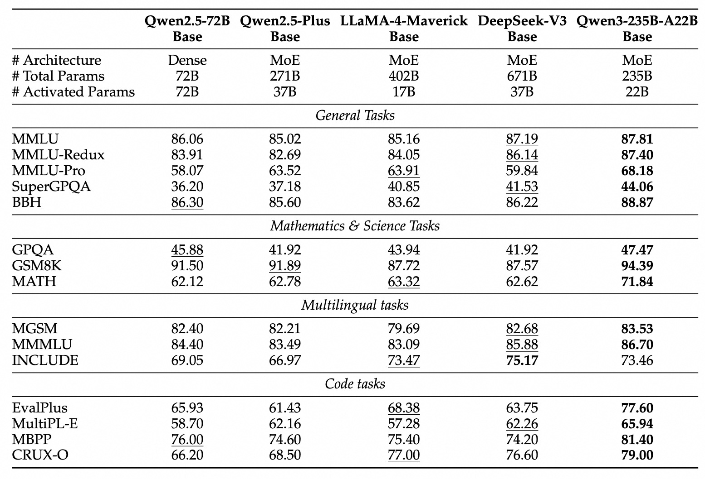

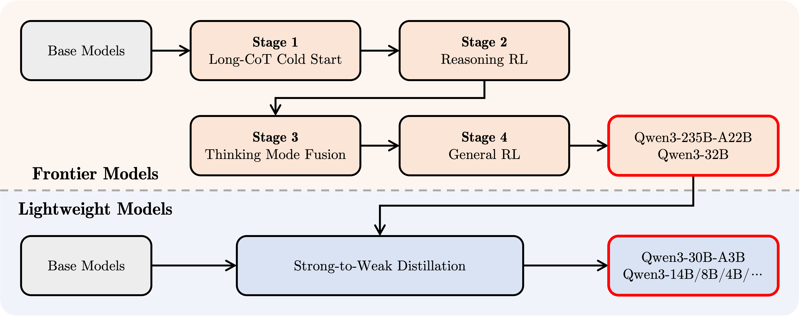

### 2.7 Qwen3-2507 与 Qwen3-Next：长上下文和效率架构的再分化

**重点解决的问题**

Qwen3-2507 解决 Qwen3 首发后“模式切换复杂、长上下文更长、推理更深”的问题；Qwen3-Next 则解决“长上下文推理太贵、MoE 仍需更高吞吐”的问题。

**专门技术**

- Qwen3-2507 把 Instruct 与 Thinking 分离为更明确的变体：Instruct 专注 non-thinking，Thinking 专注深度推理。
- Qwen3-2507 支持 256K 长上下文，并可扩展到 1M。
- Qwen3-Next-80B-A3B 使用超稀疏 MoE、Hybrid Attention 和 Gated DeltaNet，以约 3B 激活参数承载 80B 级总参数。

**架构改进**

- Qwen3-Next 将 attention 与线性/状态空间式序列建模思想结合，用 Hybrid Attention 处理长程依赖，用 Gated DeltaNet 提升长序列吞吐。
- 超稀疏 MoE 进一步降低激活参数，让大总参数模型更适合长上下文和高并发服务。

**算法/训练改进**

- Qwen3-2507 通过针对 Instruct 与 Thinking 的后训练分化，减少早期统一模式的歧义。
- Qwen3-Next 为后续 Coder-Next 提供 base，说明高效长上下文架构开始服务于 agentic coding。

**工程改进**

- 长上下文推理更依赖 vLLM/SGLang 的高效 attention、KV cache 和 MoE kernel。
- 对本地和云端服务来说，Next 的价值在于降低“仓库级/文档级 agent”成本。

**变化与局限**

Qwen3-Next 是 Qwen 架构从传统 Transformer 向混合序列模型探索的标志。局限是新架构生态初期需要 serving 框架、kernel、量化和 tokenizer 一起适配。

### 2.8 Qwen3.5 与 Qwen3.6：原生多模态 Agent 与真实开发体验

**重点解决的问题**

Qwen3.5/3.6 是 2026 年线，目标从“模型能力”转向“真实可用的 native multimodal agent”。Qwen3.5 强调多模态早融合、高效混合架构、RL 规模化和 201 语言；Qwen3.6 强调稳定性、真实开发体验、agentic coding 和 thinking preservation。

**专门技术**

- Qwen3.5 首发包括 Qwen3.5-397B-A17B MoE，后续释放 122B-A10B、35B-A3B、27B、9B、4B、2B、0.8B。
- Qwen3.5 引入 trillions 级 multimodal token 的早融合训练，官方 README 描述其视觉语言能力与 Qwen3 形成跨代对齐。
- Qwen3.5 使用 Gated Delta Networks + sparse MoE，支持高吞吐低延迟。
- Qwen3.6-35B-A3B 与 Qwen3.6-27B 强调 coding、前端工作流、仓库级 reasoning 和 thinking context 保留。

**架构改进**

- Qwen3.5 把多模态 foundation 从“VL 分支”推进到“统一主线 foundation”。
- Gated Delta Networks 与 sparse MoE 继续成为高效模型的核心结构。
- Qwen3.6 的 dense 27B 与 MoE 35B-A3B 形成“强 dense + 高效 MoE”组合。

**算法/训练改进**

- Qwen3.5 官方材料强调百万级 agent 环境的 RL 泛化、渐进复杂任务分布、异步 RL 框架。
- 多模态训练效率接近 text-only 训练，这意味着视觉/文本早融合不再被当作昂贵附加项。
- Qwen3.6 的 thinking preservation 面向多轮开发场景，减少反复重建推理上下文的成本。

**工程改进**

- Qwen Studio、Qwen API、Qwen Code、Qwen-Agent 成为官方推荐入口。
- SGLang/vLLM 提供 Qwen3.6 serving 示例；llama.cpp、MLX/MLX-VLM 支持本地运行。
- 重点从“能启动模型”进一步转向“能在真实前端、仓库、工具链任务中稳定完成工作”。

**变化与局限**

Qwen3.5/3.6 的变化是主线模型不再只是文本 LLM，而是向多模态 agent foundation 迁移。局限是公开技术细节仍主要来自 README、博客和模型卡；部分训练配方、数据组成和系统实现没有完整论文级披露。

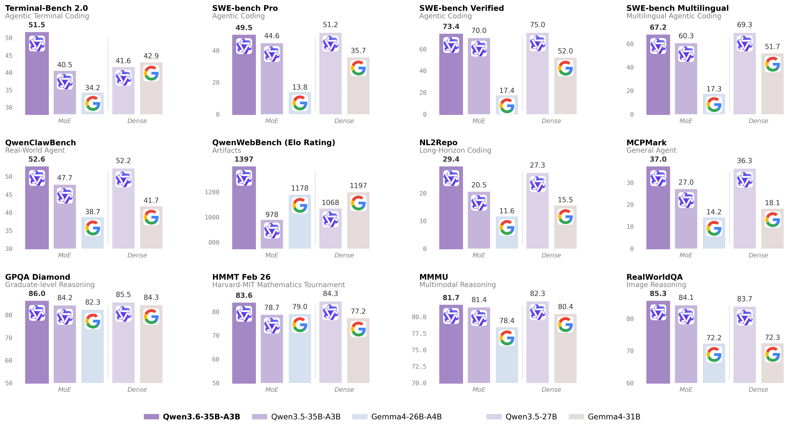

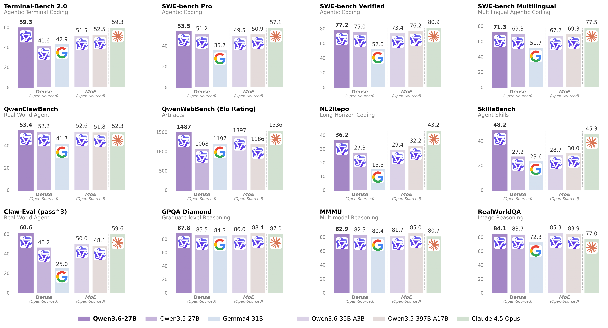

## 3. 分支专题

### 3.1 Coder：从代码补全到 agentic coding

**任务痛点**

代码模型需要解决补全、调试、重构、跨文件理解、仓库级检索、工具调用和执行反馈。普通 LLM 能写代码，但常在长上下文、工程约束和可执行性上失败。

**技术方案**

- Qwen2.5-Coder 基于 Qwen2.5 架构，进行代码语料继续预训练，覆盖从 0.5B 到 32B 的多尺寸。
- 支持 FIM（fill-in-the-middle），适合 IDE 补全和代码插入。
- Qwen3-Coder 进一步发布 480B-A35B、30B-A3B、Coder-Next 等模型，转向 agentic coding、browser-use 和仓库级任务。
- Qwen3-Coder-Next 建立在 Qwen3-Next-80B-A3B-Base 上，利用高效 hybrid/MoE 架构支持 256K 原生上下文、1M 扩展和 358 编程语言。

**架构/算法/工程改进**

- 架构：从 Qwen2.5 dense/GQA 走向 Qwen3-Next hybrid attention + MoE。
- 算法：代码继续预训练、可执行任务合成、环境交互、RL 训练、FIM 数据。
- 工程：Qwen Code、CLINE、Claude Code 风格工具调用格式，vLLM/SGLang 特定 tool parser，长上下文 repository 理解。

### 3.2 Math：从 CoT 到 TIR 与奖励模型

**任务痛点**

数学模型难点在于多步推导、符号计算、中文/英文题目、竞赛题、错误过程筛选和可验证性。

**技术方案**

- Qwen2-Math 首先专注英文 CoT 数学。
- Qwen2.5-Math 扩展到中文和英文，同时支持 CoT 与 TIR（Tool-integrated Reasoning）。
- 发布 Qwen2.5-Math-RM-72B，用奖励模型对候选解答排序。

**架构/算法/工程改进**

- 架构：沿用 Qwen2.5 LLM 主体。
- 算法：数学数据继续预训练、SFT、CoT/TIR 指令、候选采样、RM@k 选择。
- 工程：通过 Qwen-Agent 本地运行 Python 工具，让模型把自然语言推理和程序计算结合起来。

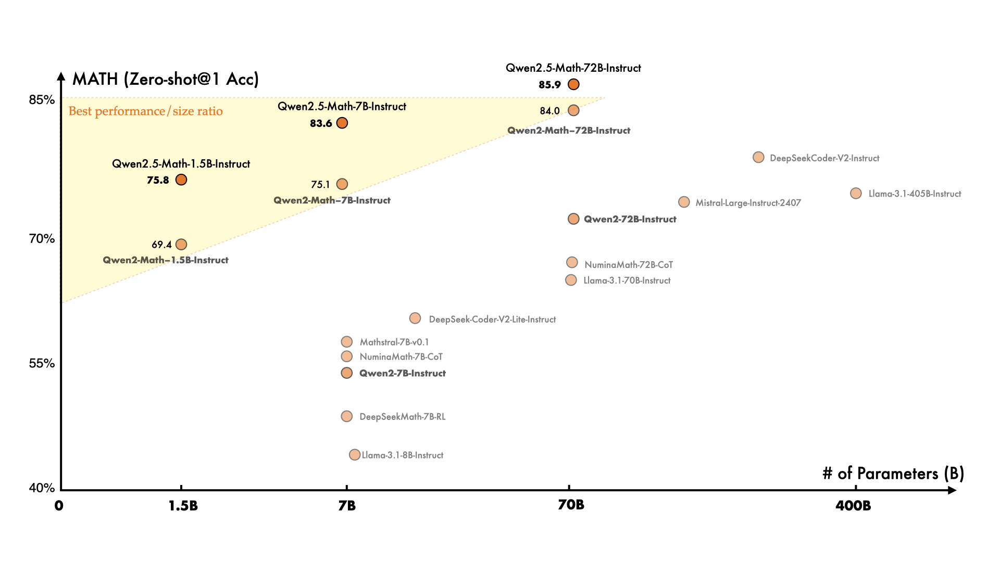

### 3.3 VL：从读图/OCR 到视觉 Agent

**任务痛点**

视觉语言模型需要同时解决图像理解、OCR、文档解析、视频理解、空间定位、GUI 控制和多步视觉推理。难点是视觉 token 太多、分辨率变化大、视频时间建模难、文本模型能力容易退化。

**技术方案**

- Qwen-VL 作为早期 VLM，加入视觉 receptor、输入/输出接口和三阶段训练，覆盖 OCR、grounding、多语 VQA。
- Qwen2-VL/Qwen2.5-VL 强化动态分辨率、视频理解、文档解析和视觉 grounding。
- Qwen3-VL 发布 Dense/MoE、Instruct/Thinking 多版本，强调 Visual Agent、Visual Coding、2D/3D grounding、长视频和长文档。

**架构/算法/工程改进**

- 架构：Qwen3-VL 使用 Interleaved-MRoPE、DeepStack、文本-时间戳对齐。
- 算法：视觉-文本预训练、视频时序建模、OCR 多语扩展、视觉 reasoning 后训练。
- 工程：cookbooks 覆盖手机/电脑 agent、OCR、长文档、视频理解、3D grounding、multimodal coding。

### 3.4 Audio、ASR、TTS：从音频理解到实时语音接口

**任务痛点**

语音和音频任务不仅是 ASR，还包括声学事件、音乐、歌曲、语音对话、语音翻译和 TTS。难点是时间对齐、低延迟、跨语言和自然度。

**技术方案**

- Qwen-Audio 覆盖 30+ 音频任务，包括语音、自然声音、音乐和歌曲。
- Qwen2-Audio 支持语音聊天和音频分析两种模式，并用 DPO 改善事实性与指令跟随。
- Qwen3-ASR 提供 0.6B/1.7B ASR，支持 52 种语言/方言，使用 NAR forced aligner 改善时间戳。
- Qwen3-TTS 发布多语、流式、可控 TTS，使用低帧率多 codebook tokenizer。

**架构/算法/工程改进**

- 架构：音频 encoder + LLM 或 Omni Thinker/Talker 组件。
- 算法：音频 instruction tuning、DPO、forced alignment、speech tokenizer、流式合成。
- 工程：音频输入输出需要低延迟 streaming、chunked input、语音事件边界和多语言前后处理。

### 3.5 Omni：从多模态输入到文本/语音端到端输出

**任务痛点**

传统多模态模型多是“图像/音频/视频 -> 文本”，而真实助手需要边听边看边说，支持实时视频语音互动，并保持文本能力不退化。

**技术方案**

- Qwen2.5-Omni 提出 Thinker-Talker 架构，输入文本、图像、音频、视频，输出文本和自然语音。
- TMRoPE（Time-aligned Multimodal RoPE）用于同步视频和音频时间戳。
- Qwen3-Omni 进一步采用 MoE Thinker-Talker、AuT 预训练、多 codebook 设计，强调低延迟实时交互。

**架构/算法/工程改进**

- 架构：Thinker 负责多模态理解与推理，Talker 负责语音生成。
- 算法：早期 text-first 预训练 + mixed multimodal training；多模态数据和语音生成联合训练。
- 工程：vLLM/Docker/DashScope API、实时交互、音视频 streaming、captioner downstream fine-tuning。

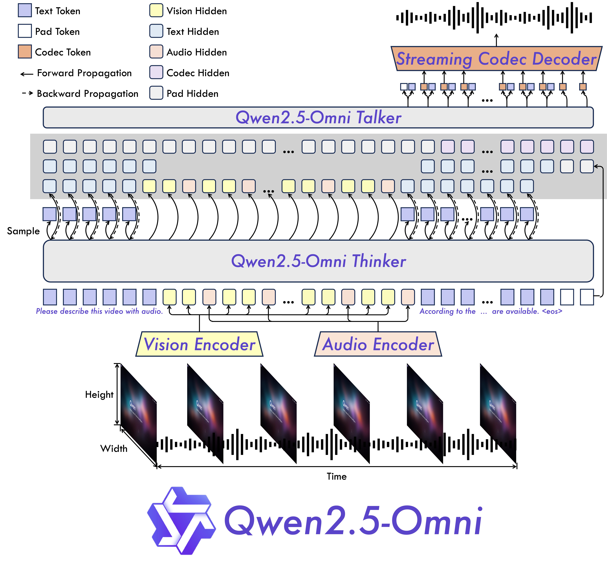

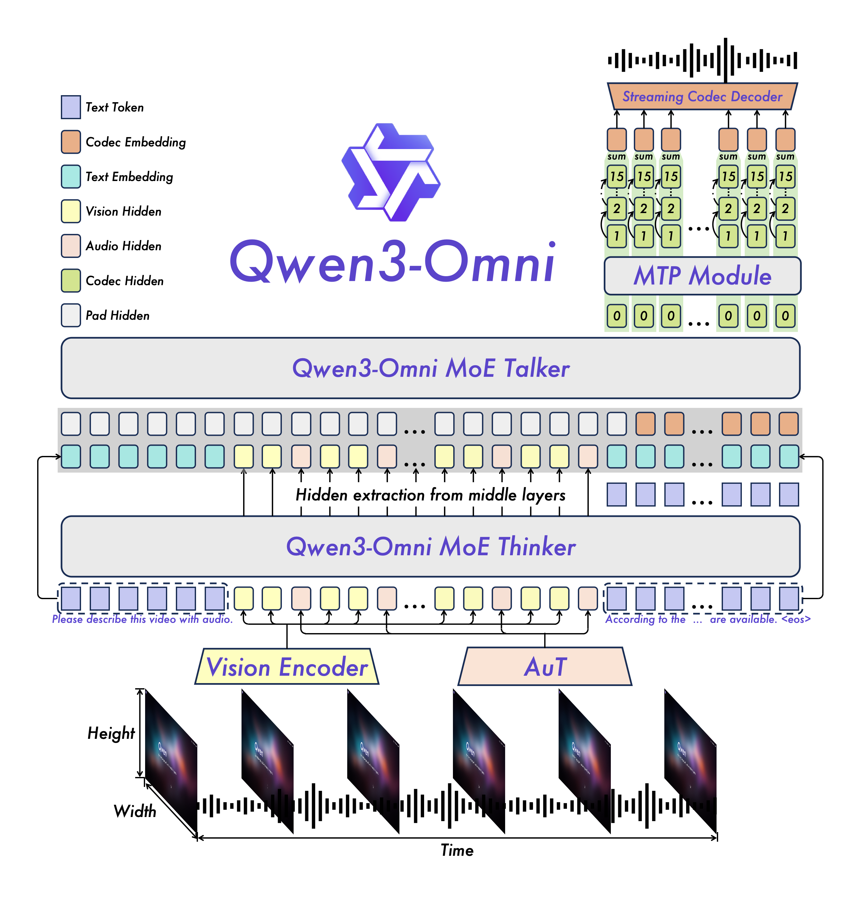

### 3.6 Image：从文字渲染到统一图像生成/编辑

**任务痛点**

图像生成模型长期难点是复杂文字渲染、中文文字、排版、图文组合和精确编辑。对中文应用而言，海报、PPT、漫画、信息图都要求模型真的“写对字”。

**技术方案**

- Qwen-Image 是 20B MMDiT image foundation model，重点解决复杂 text rendering 和 precise image editing。
- 后续 Qwen-Image-Edit、2512、2.0 继续提升真实人像、自然纹理、文字渲染、语义遵循和统一生成/编辑。

**架构/算法/工程改进**

- 架构：MMDiT 适合多模态条件下的扩散生成。
- 算法：针对文字渲染、中文排版、复杂指令和图像编辑进行训练与评测。
- 工程：diffusers、ComfyUI、vLLM-Omni、SGLang-Diffusion、LightX2V 等生态支持，包含 distillation 和 cache 加速。

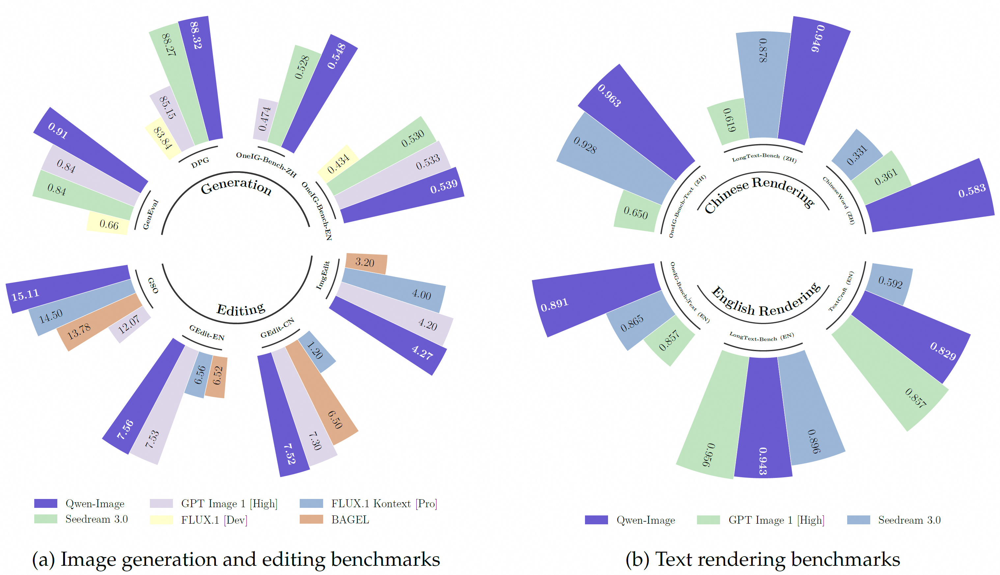

### 3.7 VLA：从视觉语言到机器人动作

**任务痛点**

机器人任务需要把视觉、语言指令、空间关系和动作轨迹连起来。VLM 能理解图像和文字，但不一定能稳定输出低层动作。

**技术方案**

Qwen-VLA 使用 Qwen3.5-4B VLM backbone 与约 1.15B DiT flow-matching action decoder，统一 manipulation、navigation 和 trajectory prediction。

**架构/算法/工程改进**

- 架构：VLM 负责语义理解，DiT action decoder 负责连续动作生成。
- 算法：flow matching 生成动作轨迹，跨任务统一训练。
- 工程：更关注仿真/真实机器人数据、动作空间、时序控制和评测协议。

### 3.8 Embedding / Reranker：让 Qwen 进入检索基础设施

**任务痛点**

RAG 和搜索系统需要稳定 embedding、reranking、多语检索、代码检索、长文本和可配置向量维度。

**技术方案**

Qwen3-Embedding 发布 0.6B、4B、8B embedding 和 reranker，支持 32K 序列、100+ 语言、MRL（Matryoshka Representation Learning）和 instruction-aware 输入。

**架构/算法/工程改进**

- 架构：继承 Qwen3 dense backbone，做 embedding/reranking 任务适配。
- 算法：指令感知 embedding、可变维度向量、跨语和代码检索训练。
- 工程：Transformers、vLLM、SentenceTransformers 使用方式明确，可直接嵌入 RAG 管线。

## 4. 关键技术总结

| 技术方向 | Qwen 中的演进 | 解决的问题 |
|---|---|---|
| Dense decoder-only Transformer | Qwen -> Qwen1.5 -> Qwen2.5 dense | 稳定、可扩展、易部署 |
| GQA | Qwen2 起主线化 | 降低 KV cache 成本，支持长上下文 |
| MoE | Qwen1.5-MoE 试水，Qwen2/Qwen3/Qwen3.5 主线化 | 总参数扩展但降低激活计算 |
| Long context | 32K -> 128K -> 256K/1M | 长文档、代码仓库、长会话 |
| Long CoT / RL | QwQ -> Qwen3 thinking | 复杂数学、代码、逻辑推理 |
| Hybrid thinking | Qwen3 统一 thinking/non-thinking | 在质量和延迟之间可控切换 |
| Hybrid Attention / Gated DeltaNet | Qwen3-Next/Qwen3.5 | 长序列高吞吐与高效推理 |
| Tool / Agent | Qwen 初代工具调用 -> Qwen-Agent/Qwen Code/MCP | 从问答到可执行任务 |
| VL/Omni | Qwen-VL -> Qwen3-VL/Qwen3-Omni | 原生多模态理解与实时交互 |
| Diffusion / DiT | Qwen-Image、Qwen-VLA | 图像生成编辑与机器人动作生成 |

## 5. 一句话总结每代“重点解决什么”

| 版本/分支 | 核心问题 | 核心技术 |
|---|---|---|
| Qwen 初代 | 开放中英 LLM 可用性与工程生态 | 3T 预训练、Chat 对齐、工具调用、量化/微调/部署 |
| Qwen1.5 | 多尺寸稳定开放与生态兼容 | 0.5B-110B、32K、HF 原生、首个 MoE |
| Qwen2 | 更长、更省、更强多语 | 7T、GQA、128K、57B-A14B MoE |
| Qwen2.5 | 通用能力成熟与专用分支体系 | 18T、结构化输出、Coder/Math/VL/Omni |
| QwQ/QVQ | 显式复杂推理 | long CoT、RL、视觉推理 |
| Qwen3 | 推理和快速响应统一 | Dense+MoE、thinking budget、四阶段后训练、119 语言 |
| Qwen3-Next | 长上下文推理成本 | Hybrid Attention、Gated DeltaNet、超稀疏 MoE |
| Qwen3.5 | 原生多模态 agent foundation | 早融合多模态、201 语言、百万 agent RL |
| Qwen3.6 | 真实开发体验与稳定 agentic coding | thinking preservation、仓库级 reasoning、前端 workflow |
| Coder | 代码补全到工程 agent | FIM、可执行任务合成、环境交互、Qwen Code |
| Math | 可验证数学推理 | CoT、TIR、Math-RM |
| VL | 视觉理解到视觉 agent | Interleaved-MRoPE、DeepStack、grounding、视频 |
| Omni | 实时多模态对话 | Thinker-Talker、TMRoPE、AuT、多 codebook |
| Image | 中文文字和复杂排版生成 | 20B MMDiT、图像编辑、diffusion 加速生态 |
| VLA | 从理解到动作 | VLM backbone + DiT action decoder |

## 6. 结论：Qwen 的长期技术路线

Qwen 系列不是单纯沿着“参数更多、分数更高”推进，而是在三个层面同时扩张：

- **模型层**：dense、MoE、hybrid attention、Gated DeltaNet、Diffusion/DiT 并行发展。
- **训练层**：大规模预训练、合成数据、long CoT、RL、TIR、reward model、多模态早融合逐步组合。
- **工程层**：Hugging Face/ModelScope、vLLM/SGLang、llama.cpp/MLX、Qwen-Agent、Qwen Code、API、Studio、量化和端侧部署持续完善。

从 2023 到 2026，Qwen 的路线可以理解为：先把中文/中英开放 LLM 做强，再把多尺寸和工程生态做稳，然后用 Coder/Math/VL/Audio 等分支补齐专门能力，最后把推理、agent 和多模态统一回主线模型。Qwen3.5/3.6 已经显示出新的方向：基础模型不再只是聊天模型，而是面向真实开发、检索、视觉操作、语音视频交互和机器人动作的原生 agent foundation。

